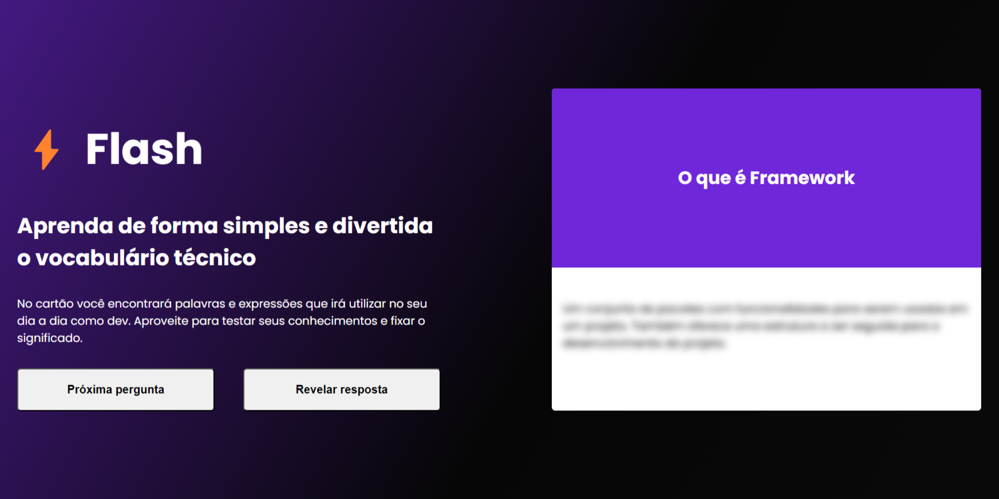

# Flash

  

## 📑 Description

This application was created during the Quick Staart event, an event developed by Staart - Grupo Primo.

## 🔗 Functions

Flash is a project in quiz format that aims to test and improve the developer's vocabulary, where questions and answers are received through an API created for the development of this project.

## 💻 Language and Tools

For the development of this project, the following languages and tools were used:

- [HTML](https://developer.mozilla.org/pt-BR/docs/Web/HTML)
- [CSS](https://developer.mozilla.org/pt-BR/docs/Web/CSS)
- [JavaScript](https://developer.mozilla.org/pt-BR/docs/Web/JavaScript)

## 🚀 Deploy

Click on the link below to access the project 👇🏾

- [Flash](https://hrodrigomota.github.io/flash/)
